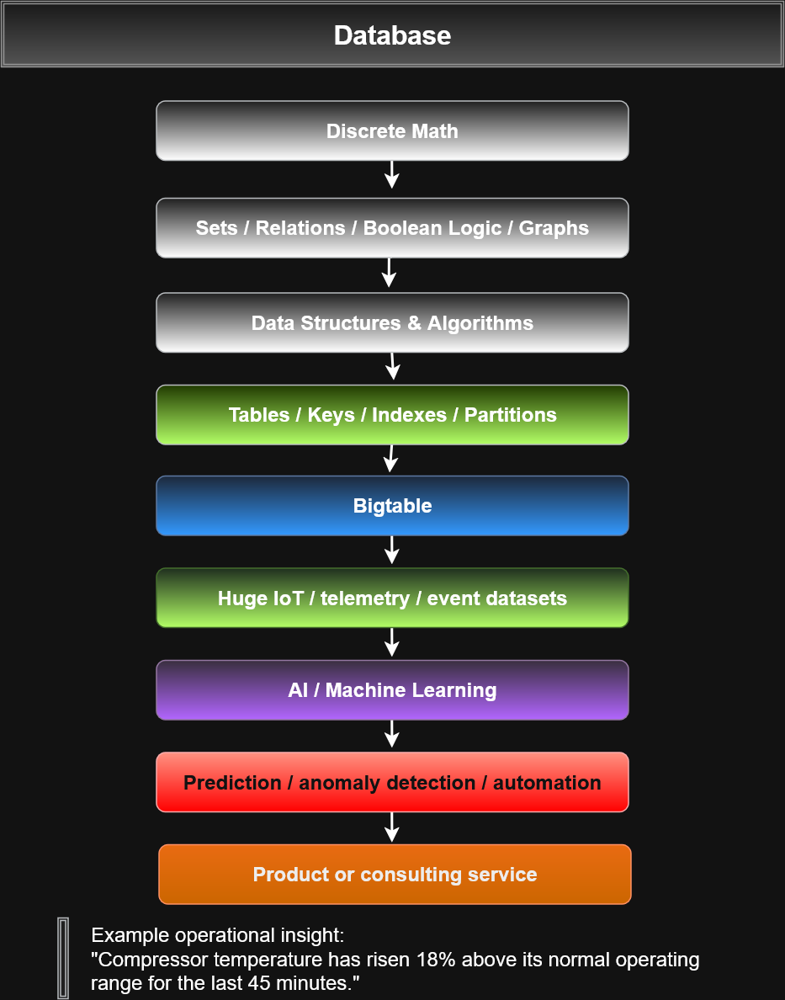

# IoT Bigtable Analytics Platform

## Overview

The IoT Bigtable Analytics Platform is a portfolio project that connects
computer science foundations with cloud-scale data engineering, IoT telemetry,
analytics, and machine learning.

The project demonstrates a progression from:

**Discrete Mathematics → Data Structures → Bigtable → IoT Data → AI/ML → Operational Insights**

The goal is to explore how large volumes of sensor and event data can be
collected, organized, analyzed, and converted into useful operational decisions.

---

## Project Architecture

```text
Raspberry Pi / ESP32
        │
        ▼
Sensor Observations
        │
        ▼
Data Ingestion
        │
        ▼
Google Cloud Bigtable
        │
        ▼
Analytics / Feature Engineering
        │
        ▼
AI / Machine Learning
        │
        ▼
Dashboard / Alerts
        │
        ▼
Operational Decision
```

---

## Academic Foundations

This project connects concepts from several areas of computer science.

### Discrete Mathematics

Relevant concepts include:

- mSets
- Relations
- Boolean logic
- Graphs
- Intersections
- Unions
- Predicates
- Cardinality

Example:
```text
A = customers purchasing Product X
B = customers purchasing Product Y

A ∩ B = customers purchasing both
A ∪ B = customers purchasing either
A - B = customers purchasing X but not Y
```
These concepts can be applied to:

- Database filtering
- Query conditions
- Classification
- Feature engineering
- Rule-based analytics

---

## Data Structures and Algorithms

The project also reinforces concepts such as:

- Key/value mappings
- Sorted keys
- Indexes
- Partitions
- Sparse data structures
- Row keys
- Column families

These concepts provide a foundation for understanding distributed
NoSQL systems such as Google Cloud Bigtable.

---

## Google Cloud Bigtable

Bigtable is a fully managed NoSQL database designed for:

- Very large datasets
- High read/write throughput
- Low latency
- Horizontal scaling
- IoT telemetry
- Event data
- Analytical workloads

A simplified data model for this project could use row keys such as:
`building-a#machine-01#sensor-03#2026-09-12T20:00:00`

Possible column families:
```text
telemetry:
    temperature
    humidity
    equipment_state

analytics:
    anomaly_score
    maintenance_status
    predicted_failure
```

---

## IoT Data Sources

Potential data sources include:

- Raspberry Pi
- ESP32
- Temperature sensors
- Humidity sensors
- Equipment-state sensors
- Environmental sensors
- Industrial equipment telemetry

Example observation:
```text
device_id: sensor-03
machine_id: machine-01
building: building-a
temperature: 92.4
humidity: 84
equipment_state: running
timestamp: 2026-09-12T20:00:00
```

---
## Boolean Logic and Feature Engineering

Raw sensor readings can be transformed into features.

Example:
```bash
high_temperature = temperature > 90
high_humidity = humidity > 80

danger_condition = high_temperature and high_humidity
```

This demonstrates the progression:
```text
Raw Observation
      ↓
Set / Category Membership
      ↓
Boolean Predicate
      ↓
Feature Engineering
      ↓
Machine Learning Model
```

---

## Analytics and Machine Learning

Future analytics could include:

- Temperature anomaly detection
- Humidity anomaly detection
- Equipment behavior analysis
- Maintenance trend detection
- Failure prediction
- Usage-pattern recognition
- Threshold-based alerts

The project can begin with deterministic rules and later expand into
machine-learning models.

---

